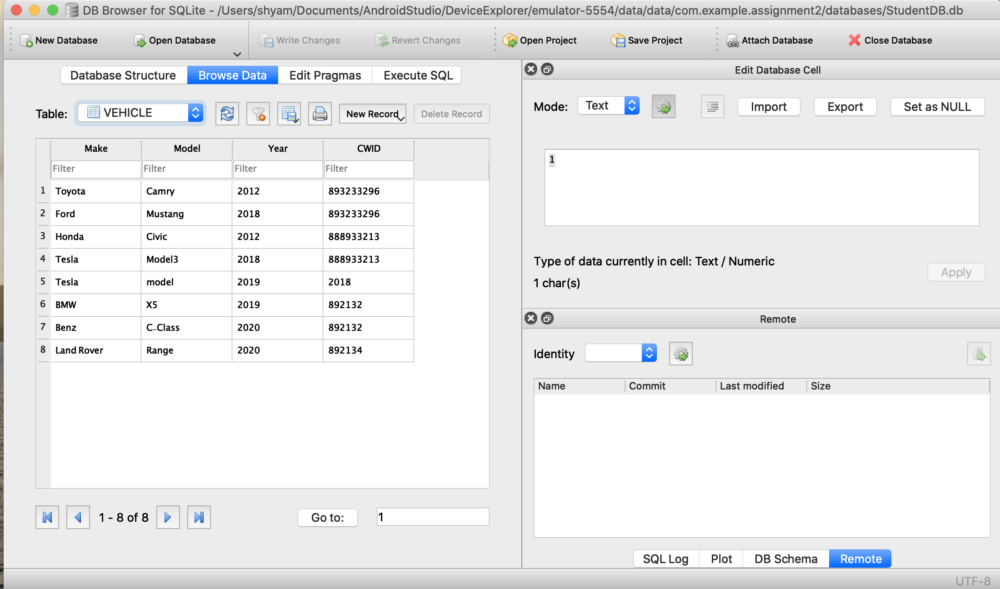
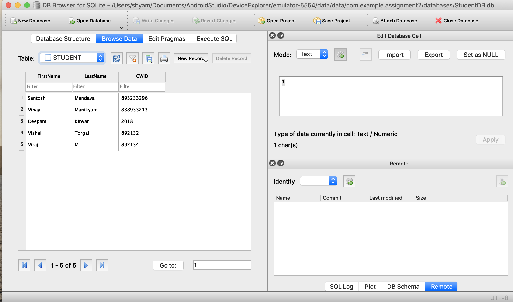
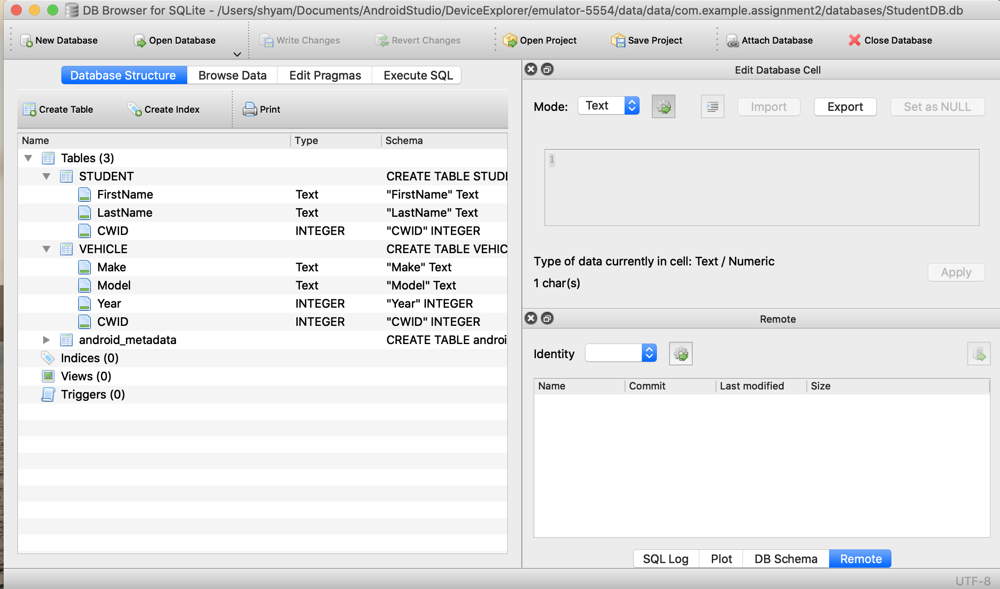
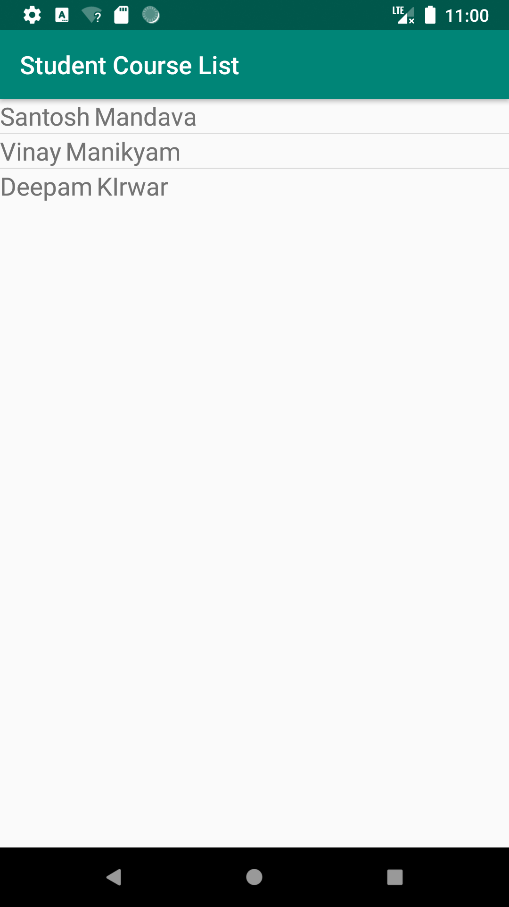
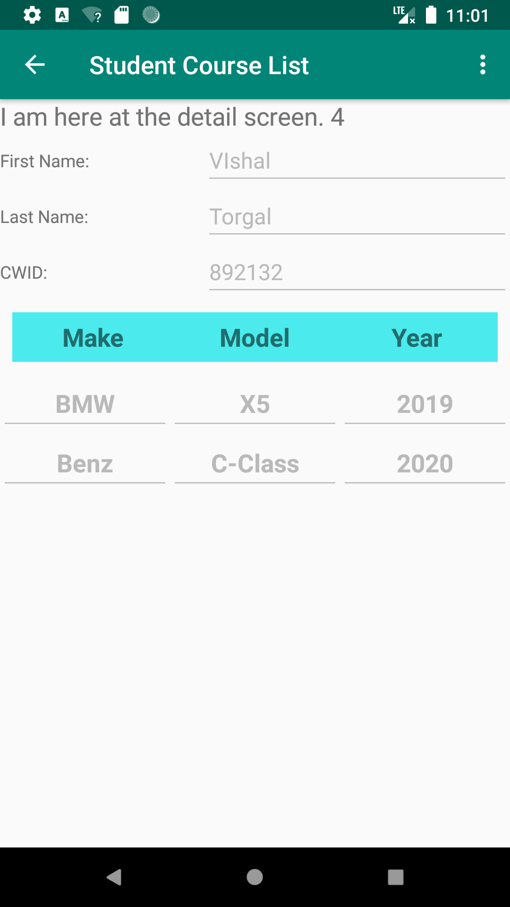
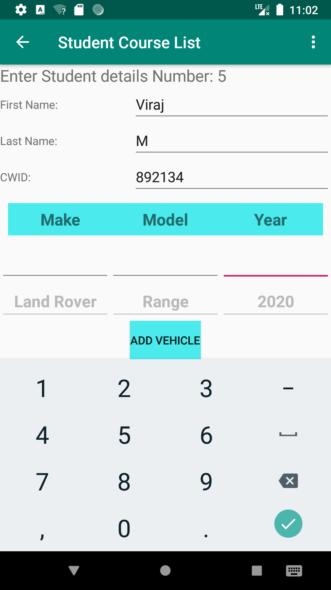

# CPSC411-Assignment 3
CPSC411 Assignment 3

Download the Project and open in android studio
Save the StudentDB.db file from the device file explorer in android studio. Open the DB browser Lite.

